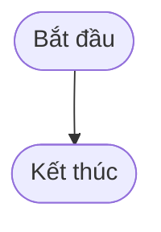

# BÁO CÁO PHẢN BIỆN TOÀN DIỆN BẢN THẢO SRS RIKKEITRAVEL

> 👤 **Học viên:** Đỗ Hoàng Sơn | **Mã SV:** PTIT-HCM-066
> 🏫 **Môn học:** IT105-K25-Phan-tich-thi-t-k-h-th-ng

---

## 📊 Sơ đồ thiết kế hệ thống (Flowchart)

> 💡 *Sơ đồ dưới đây được render tự động trực tiếp trên GitHub bằng Mermaid. Bạn cũng có thể tải file **`bt3.drawio`** trong repository này để mở và chỉnh sửa trực tiếp trên [Draw.io (diagrams.net)](https://app.diagrams.net).* 

---

## Nhiệm vụ 1: Bảng lỗi phát hiện trong bản thảo SRS RikkeiTravel

Sau khi đọc kỹ bản thảo SRS phân hệ 'Đặt tour trọn gói' của RikkeiTravel, tôi đã rà soát toàn bộ cấu trúc theo chuẩn IEEE 830 và đánh giá dựa trên 8 đặc tính vàng của SRS. Dưới đây là bảng tổng hợp các lỗi phát hiện được kèm theo phương án khắc phục chi tiết:

- Tổng số lỗi phát hiện: 6 lỗi nghiêm trọng thuộc cả hai nhóm sai cấu trúc IEEE 830 và vi phạm đặc tính vàng.
- Các đặc tính vàng bị vi phạm: Verifiable (Tính kiểm thử được), Non-contradictory (Tính không mâu thuẫn), Complete (Tính đầy đủ), Modifiable (Tính dễ sửa đổi).

| STT | Nội dung lỗi | Phân loại lỗi | Vị trí đúng hoặc cách khắc phục |
| --- | --- | --- | --- |
| 1 | Mục '1.2 Scope' chỉ định nghĩa nhóm khách hàng nhưng bỏ sót actor phía hệ thống và ranh giới hệ thống. | Vi phạm đặc tính vàng: Complete (Tính đầy đủ) | Bổ sung đầy đủ các Actor tham gia vào phạm vi hệ thống như Nhân viên đặt tour, Điều phối viên RikkeiTravel, và hệ thống thanh toán bên thứ ba. |
| 2 | Mục '2.4 Constraints' liệt kê Actor và Use Case. Thực tế Actor và Use Case thuộc về phần mô tả chức năng hoặc mục '3. Specific Requirements', không nằm ở Ràng buộc hệ thống. | Sai vị trí cấu trúc IEEE 830 (Sai vị trí chương) | Di chuyển toàn bộ thông tin Actor và danh sách Use Case sang mục '3.1 External Interfaces' hoặc '3.2 Functional Requirements' theo đúng chuẩn IEEE 830. |
| 3 | REQ-21 dùng từ ngữ mơ hồ: 'Hệ thống phải phản hồi báo giá... một cách nhanh chóng'. Từ 'nhanh chóng' là chủ quan, không có mốc thời gian cụ thể. | Vi phạm đặc tính vàng: Verifiable (Tính kiểm thử được) | Viết lại thành định lượng: 'Hệ thống phải gửi email báo giá cho khách hàng doanh nghiệp trong vòng tối đa 3 phút kể từ khi nhận đủ yêu cầu hợp lệ'. |
| 4 | Mâu thuẫn nghiêm trọng giữa REQ-23 (trang 8) và REQ-24 (trang 19). REQ-23 cho phép điều phối viên chỉnh sửa bất cứ lúc nào, trong khi REQ-24 khóa cứng thông tin sau khi thanh toán. | Vi phạm đặc tính vàng: Non-contradictory (Tính không mâu thuẫn) | Loại bỏ hoàn toàn REQ-23. Thống nhất áp dụng quy tắc nghiệp vụ duy nhất tại REQ-24: Sau khi thanh toán 100%, mọi thông tin báo giá và hợp đồng bị khóa cứng, không ai được phép sửa đổi trực tiếp. |
| 5 | REQ-25 nêu tính năng xuất PDF 'có thể được cân nhắc bổ sung sau, tùy nguồn lực', thiếu mức độ ưu tiên rõ ràng cho nhóm phát triển. | Vi phạm đặc tính vàng: Modifiable và Unambiguous | Xếp hạng rõ ràng REQ-25 là tính năng loại 'Optional' hoặc 'Nice-to-have' (Ưu tiên thấp - Phase 2) để đội ngũ dev không bị bối rối khi lên kế hoạch Sprint. |
| 6 | Mục '1.3 Definitions' lại đi mô tả sơ đồ ERD (Sơ đồ cơ sở dữ liệu), sai hoàn toàn mục đích của mục Definitions (vốn chỉ dùng để giải thích thuật ngữ, từ viết tắt). | Sai vị trí cấu trúc IEEE 830 (Sai vị trí chương) | Chuyển sơ đồ ERD xuống phần Phụ lục (Appendix) hoặc mục thiết kế dữ liệu riêng biệt. Mục '1.3 Definitions' chỉ định nghĩa các thuật ngữ nghiệp vụ như 'Tour trọn gói', 'Doanh nghiệp hạng A'... |

## Nhiệm vụ 2: Đề xuất bản chỉnh sửa hoàn chỉnh SRS RikkeiTravel

Dựa trên các lỗi đã phản biện ở Bước 1, tôi tiến hành viết lại các phần chỉnh sửa hoàn chỉnh, đảm bảo tính chuẩn mực của IEEE 830 và tuân thủ tuyệt đối các đặc tính vàng của SRS.

- Chỉnh sửa mục 1.2, 1.3 và 2.4 về đúng vị trí trong cấu trúc IEEE 830.
- Viết lại REQ-21 đạt chuẩn Verifiable có định lượng thời gian cụ thể.
- Giải quyết triệt để xung đột giữa REQ-23 và REQ-24 bằng một quy tắc nghiệp vụ quán triệt.
- Xác định rõ ràng mức độ ưu tiên cho REQ-25.

| Mã yêu cầu / Mục | Nội dung SRS chỉnh sửa hoàn chỉnh | Ghi chú kỹ thuật |
| --- | --- | --- |
| 1.2 Scope | Phân hệ 'Đặt tour trọn gói' hỗ trợ khách hàng doanh nghiệp (nhóm từ 10 người trở lên) tạo yêu cầu, nhận báo giá tự động và thanh toán hợp đồng du lịch. Hệ thống tương tác trực tiếp với Nhân viên đặt tour doanh nghiệp và Điều phối viên RikkeiTravel. | Đã làm rõ phạm vi và các bên liên quan. |
| 1.3 Definitions | Định nghĩa thuật ngữ:
- 'Khách hàng doanh nghiệp': Tổ chức, công ty đăng ký tour cho nhân viên.
- 'Tour trọn gói': Gói dịch vụ bao gồm vận chuyển, lưu trú và ăn uống theo lịch trình cố định. | Đưa phần giải thích thuật ngữ về đúng vị trí IEEE 830, chuyển ERD xuống Phụ lục. |
| 2.4 Constraints | Ràng buộc hệ thống:
- Hệ thống phải tuân thủ Luật Du lịch hiện hành.
- Giao diện tích hợp cổng thanh toán trực tuyến qua ngân hàng đối tác.
- Thời gian phản hồi API không vượt quá 2 giây dưới tải 500 concurrent users. | Loại bỏ hoàn toàn các Actor và Use Case bị đặt nhầm chỗ ở phiên bản cũ. |
| REQ-21 (Chỉnh sửa) | Hệ thống phải tự động gửi bản báo giá chi tiết qua email cho Nhân viên đặt tour của doanh nghiệp trong thời gian tối đa 3 phút tính từ thời điểm nhận được yêu cầu hợp lệ. | Đã có mốc thời gian cụ thể, dễ dàng viết test case kiểm thử (Verifiable). |
| REQ-24 (Quy tắc duy nhất) | Sau khi khách hàng xác nhận thanh toán đủ 100% giá trị hợp đồng, toàn bộ dữ liệu báo giá, danh sách đoàn và lịch trình sẽ được khóa trạng thái vĩnh viễn trên hệ thống. Mọi yêu cầu điều chỉnh phát sinh sau đó phải được lập phụ lục hợp đồng mới, tuyệt đối không cho phép chỉnh sửa trực tiếp trên bản ghi cũ. | Đã loại bỏ hoàn toàn REQ-23 mâu thuẫn trước đó, đảm bảo tính nhất quán dữ liệu và kiểm toán (Audit log). |
| REQ-25 (Ưu tiên) | Tính năng xuất báo giá ra file PDF.
- Mức độ ưu tiên: Thấp (Low Priority / Optional).
- Ghi chú: Đưa vào kế hoạch phát triển ở giai đoạn Phase 2, không bắt buộc triển khai trong Sprint 1. |

---

## 📁 Danh sách tệp tin nộp bài trong Repository
- 📝 `bt3.docx`: Báo cáo tài liệu phân tích nghiệp vụ hoàn chỉnh.
- 🎨 `bt3.drawio`: File thiết kế sơ đồ chuẩn theo quy định đề bài (mở trực tiếp bằng [Draw.io](https://app.diagrams.net) hoặc Lucidchart).
